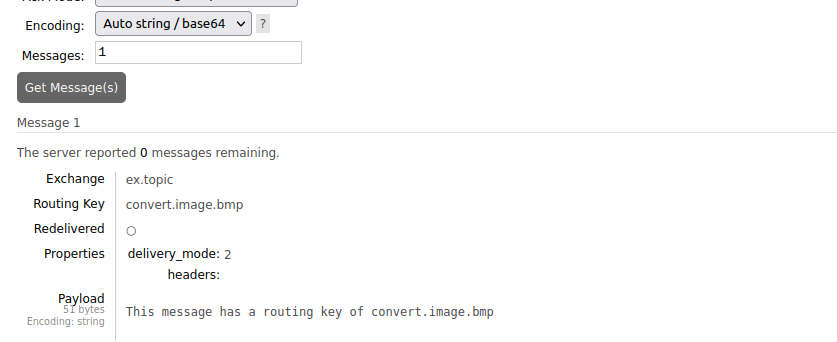

# RabbitMQ

Commands:

````bash
docker pull rabbitmq:3-management
docker run --rm -d -p 15672:15672 -p 5672:5672 --name my_rabbitmq rabbitmq:3-management
#http://localhost:15672
#guest guest
````

# Images

## Element and Attributes

Element of mesaaging system


Binding


Attributes of Messages


Attributes of a Queue


Attributes of a Exchange


## Exchanges


Exchanges


## Fanout Exchange

Add Fanout Exange


Add Queue


Binding Queue


Publish message from the Exchange


Get messages from the Queue


## Direct Exchange


## Topic Exchange




## Headers Exchange


